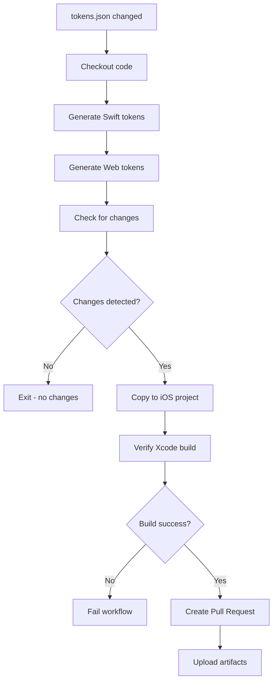

# GitHub Actions Workflows

## Design Tokens Sync

**File**: `design-tokens-sync.yml`
**Purpose**: Automatically regenerate design tokens when `tokens.json` changes

### How It Works

1. **Trigger**: Runs when `design-system/tokens.json` is modified
2. **Generate**: Creates Swift and Web tokens from JSON
3. **Verify**: Compiles iOS project to ensure no breaking changes
4. **PR**: Creates pull request with updated tokens for review

### Workflow Steps



### What Gets Generated

- `design-system/generated/DesignTokens.swift` (iOS tokens)
- `design-system/generated/design-tokens.css` (Web CSS variables)
- `design-system/generated/design-tokens.js` (Web JS module)
- `Zero_ios_2/Zero/Config/DesignTokens.swift` (copied from generated)

### PR Content

The automated PR includes:
- Commit message with file list
- Build verification status
- Review checklist
- Testing instructions
- Labels: `design-system`, `auto-generated`, `tokens`

### Manual Trigger

You can manually trigger the workflow:

```bash
# Via GitHub UI
# Go to Actions → Design Tokens Sync → Run workflow

# Via GitHub CLI
gh workflow run design-tokens-sync.yml
```

### Local Testing

Before pushing tokens.json changes:

```bash
# Test token generation locally
node design-system/sync/generate-swift.js
node design-system/sync/generate-web.js

# Verify iOS build
xcodebuild -project Zero_ios_2/Zero/Zero.xcodeproj \
  -scheme Zero \
  -destination 'platform=iOS Simulator,name=iPhone 16' \
  build
```

### Workflow Secrets

No secrets required - uses default `GITHUB_TOKEN` for PR creation.

### Artifacts

Generated tokens are uploaded as artifacts and retained for 30 days:
- Artifact name: `generated-tokens`
- Retention: 30 days
- Contains: All generated token files

### Linting

The workflow includes a separate `lint-tokens` job that:
- Validates JSON syntax
- Checks for required fields (`$value`)
- Detects potential duplicates
- Reports token statistics

### Error Handling

If the workflow fails:

1. **JSON syntax error**: Check `design-system/tokens.json` for valid JSON
2. **Build failure**: Generated Swift may have syntax errors
3. **Missing fields**: Tokens must have `$value` or nested structure

### Benefits

✅ **Automation**: No manual token generation
✅ **Verification**: Build tested before PR creation
✅ **Review**: Changes reviewed before merging
✅ **Consistency**: Same process every time
✅ **History**: All token changes tracked in git

### Future Enhancements

- [ ] Add visual regression testing
- [ ] Sync to Figma automatically
- [ ] Notify Slack channel
- [ ] Generate changelog
- [ ] Version bumping
